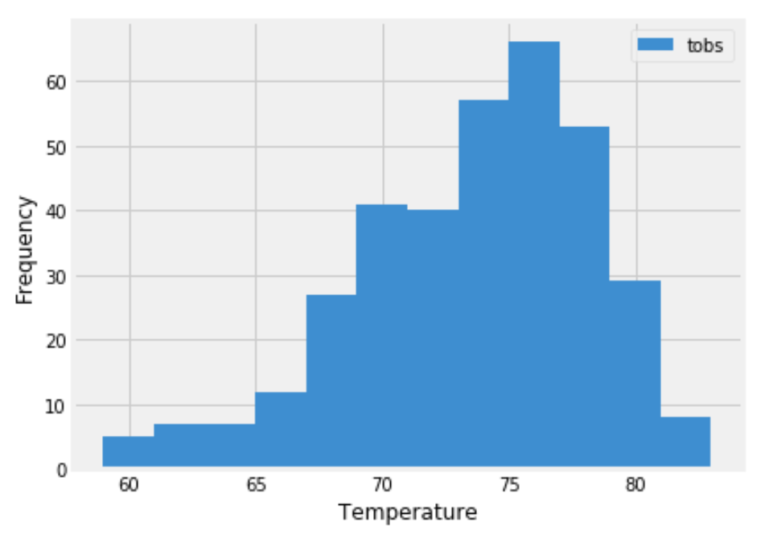

# Climate Analysis in Honolulu

## Instructions 
## Step 1 - Climate Analysis and Exploration
Use Python and SQLAlchemy to do basic climate analysis and data exploration of your climate database. All of the following analysis should be completed using SQLAlchemy ORM queries, Pandas, and Matplotlib.
* Use SQLAlchemy `create_engine` to connect to your sqlite database.
* Use SQLAlchemy `automap_base()` to reflect your tables into classes and save a reference to those classes called `Station` and `Measurement`.
* Link Python to the database by creating an SQLAlchemy session.

### Precipitation Analysis
* Find the most recent date in the data set.
* Using this date, retrieve the last 12 months of precipitation data by querying the 12 preceding months of data. 
* Select only the `date` and `prcp` values.
* Load the query results into a Pandas DataFrame and set the index to the date column.
* Sort the DataFrame values by `date`.
* Plot the results using the DataFrame `plot` method.

* Use Pandas to print the summary statistics for the precipitation data.

### Station Analysis

* Design a query to calculate the total number of stations in the dataset.
* Design a query to find the most active stations (i.e. which stations have the most rows?).
  * List the stations and observation counts in descending order.
  * Which station id has the highest number of observations?
  * Using the most active station id, calculate the lowest, highest, and average temperature.
* Design a query to retrieve the last 12 months of temperature observation data (TOBS).
  * Filter by the station with the highest number of observations.
  * Query the last 12 months of temperature observation data for this station.
  * Plot the results as a histogram with `bins=12`.

* Close out your session.

- - -

## Step 2 - Climate App

Design a Flask API based on the queries that you have completed the initial analysis. Use Flask to create your routes.

### Routes

* `/`
  * Home page.
  * List all routes that are available.

* `/api/v1.0/precipitation`
  * Convert the query results to a dictionary using `date` as the key and `prcp` as the value.
  * Return the JSON representation of your dictionary.

* `/api/v1.0/stations`
  * Return a JSON list of stations from the dataset.

* `/api/v1.0/tobs`
  * Query the dates and temperature observations of the most active station for the last year of data.
  * Return a JSON list of temperature observations (TOBS) for the previous year.

* `/api/v1.0/<start>` and `/api/v1.0/<start>/<end>`
  * Return a JSON list of the minimum temperature, the average temperature, and the max temperature for a given start or start-end range.
  * When given the start only, calculate `TMIN`, `TAVG`, and `TMAX` for all dates greater than and equal to the start date.
  * When given the start and the end date, calculate the `TMIN`, `TAVG`, and `TMAX` for dates between the start and end date inclusive.

- - -

## Other Recommended Analysis

## Temperature Analysis I
* Use pandas to perform analysis whether there is a meaningful difference between the temperature in June and December in Hawaii.
  * Convert the date column format from string to datetime.
  * Set the date column as the DataFrame index
  * Drop the date column
* Identify the average temperature in June and December at all stations across all available years in the dataset.
* Use the t-test (paired or unpaired) to determine whether the difference in the means, if any, is statistically significant. 

## Temperature Analysis II
* Find the temperature of Aug 1st to Aug 7th in Hawaii using historical data in the dataset.
* Use `calc_temps` function that will accept `%Y-%m-%d` format, and return the minimum, average, and maximum temperatures for that range of dates.
* Plot the min, avg, and max temperature from your previous query as a bar chart.
  * Use "Trip Avg Temp" as the title.
  * Use the average temperature as the bar height (y value).
  * Use the peak-to-peak (TMAX-TMIN) value as the y error bar (YERR). 

### Daily Rainfall Average
* Calculate the rainfall per weather station using the previous year's matching dates.
  * Sort this in descending order by precipitation amount and list the station, name, latitude, longitude, and elevation.

### Daily Temperature Normals
* Calculate the daily normals which is the averages for the min, avg, and max temperatures. 
  * Set the start and end date of the trip.
  * Use the date to create a range of dates.
  * Strip off the year and save a list of strings in the format `%m-%d`.
  * Use the `daily_normals` function to calculate the normals for each date string and append the results to a list called `normals`.
* Load the list of daily normals into a Pandas DataFrame and set the index equal to the date.
* Use Pandas to plot an area plot (`stacked=False`) for the daily normals. 
 

* Close out your session.
